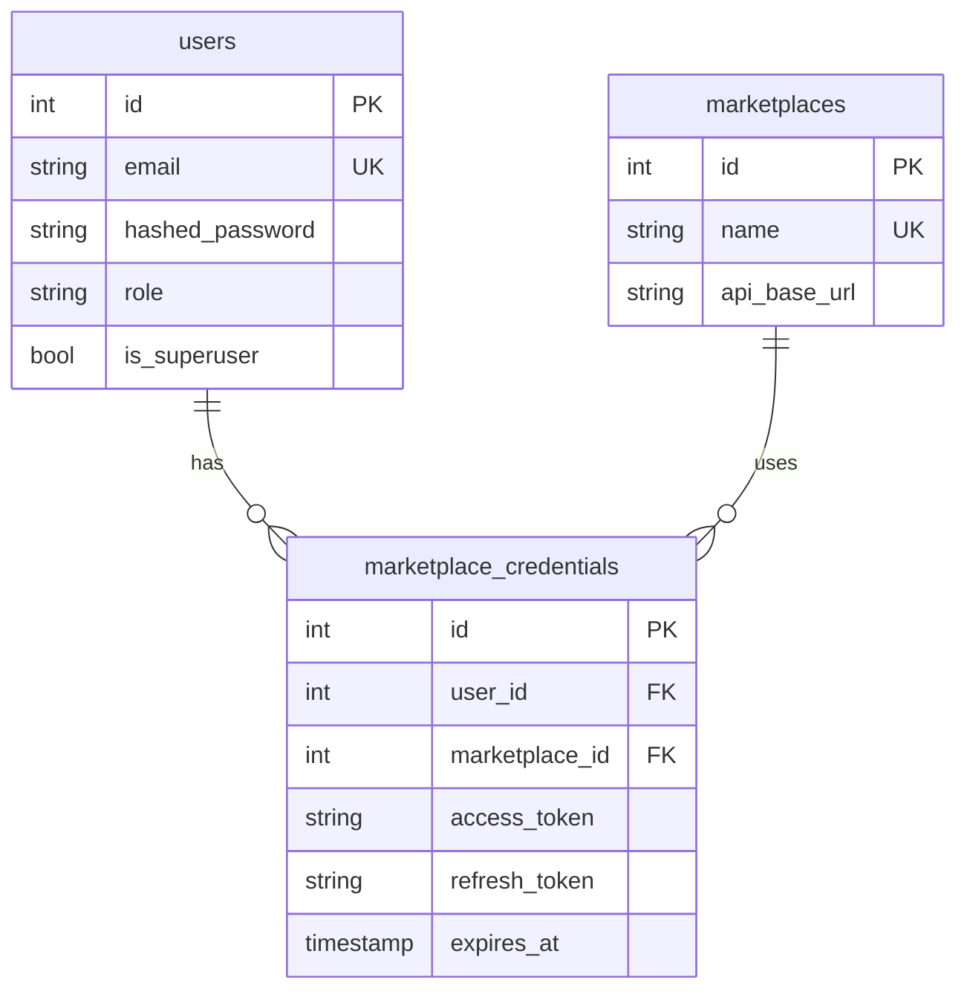
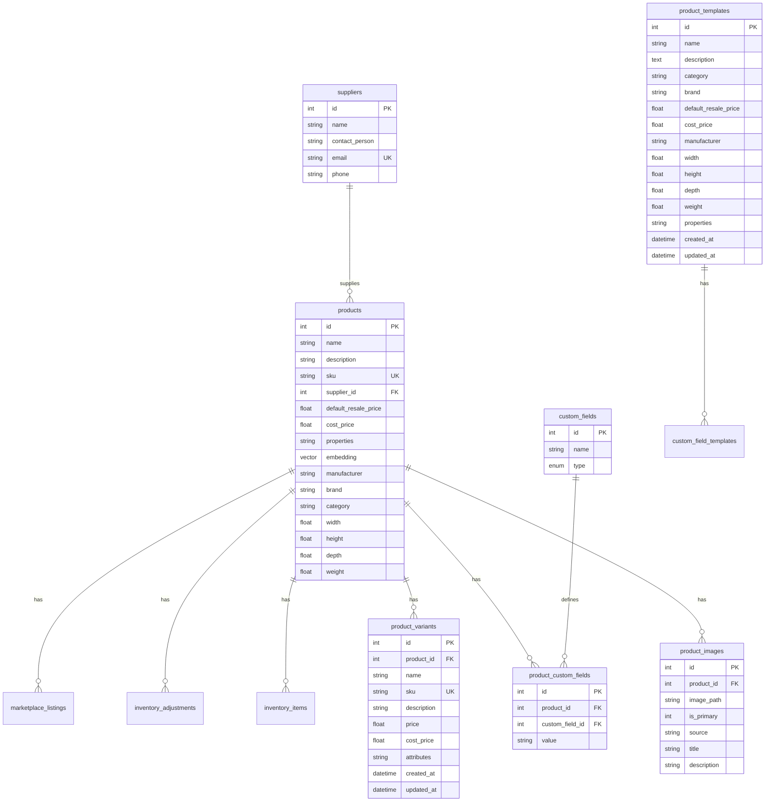
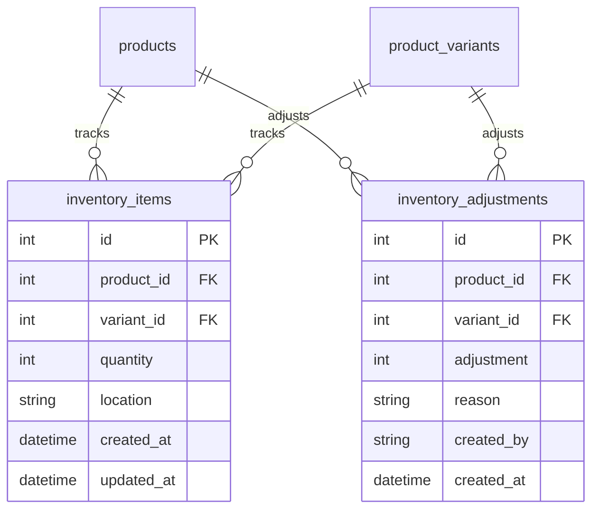
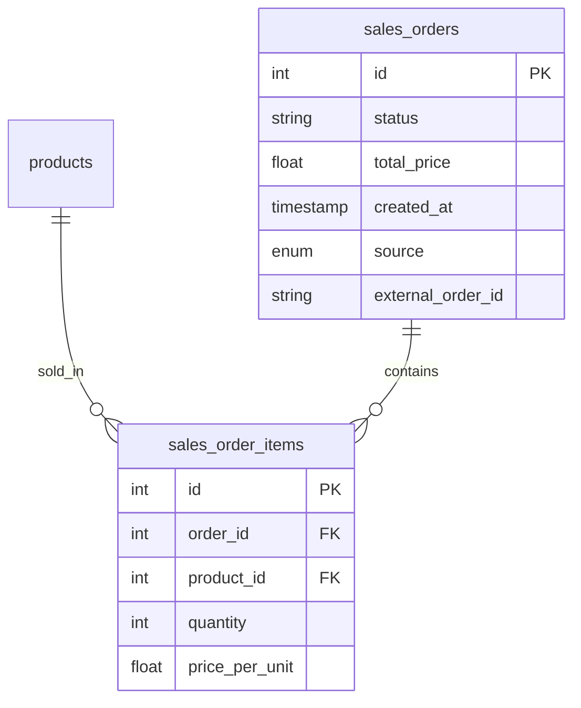
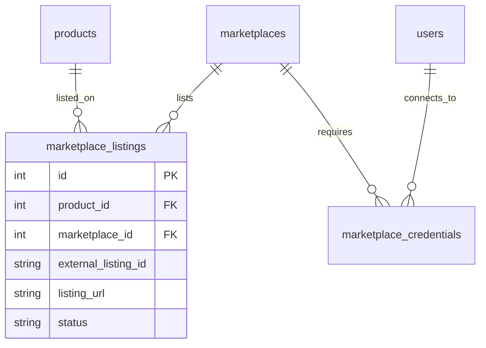
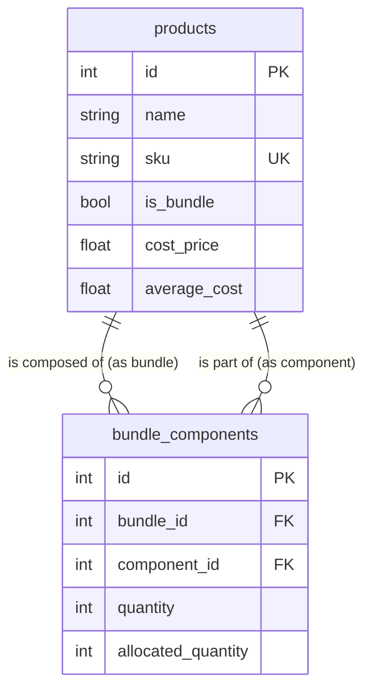
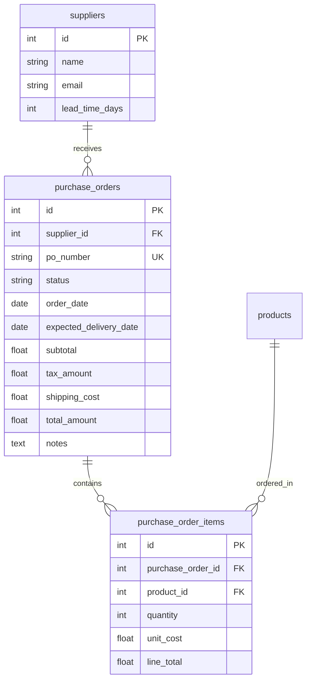
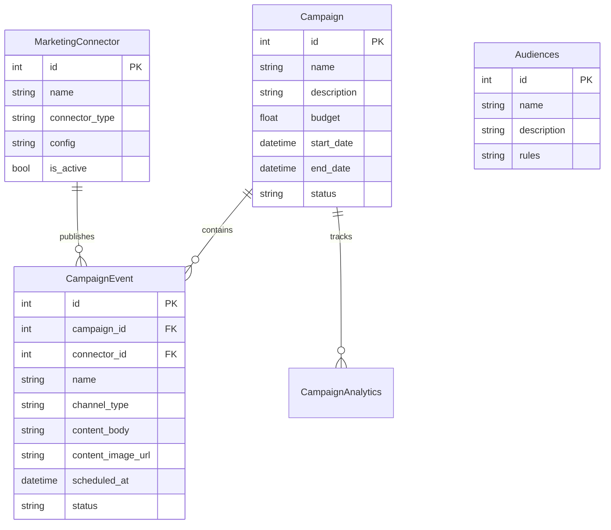
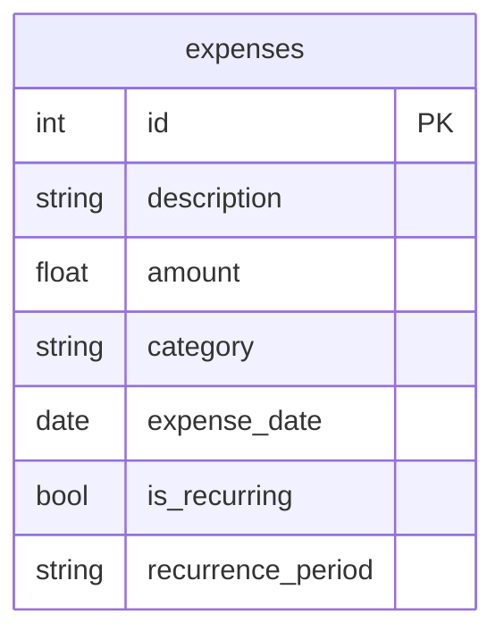

# Database Architecture

This document provides an overview of the database schema and relationships in
the Fulcrum platform. The database is designed to support inventory management,
user accounts, marketplace integrations, and order processing with a clean,
normalized structure.

## Core Tables Overview

### User Management

The user system supports different types of users with appropriate access
controls and authentication.

- **users**: Stores user account information including credentials and
  permissions.

### Product Catalog

The product catalog supports complex product structures with variants, custom
fields, and rich media.

- **products**: Main product table with standard attributes like name, SKU,
  pricing, and dimensions.
- **product_images**: Stores all images associated with each product.
- **product_variants**: Handles product variations (size, color, etc.) for the
  same base product.
- **custom_fields**: Defines custom attributes that can be applied to products.
- **product_custom_fields**: Links products to their custom field values.
- **product_templates**: Template system for creating new products with
  predefined attributes.

### Inventory Management

The inventory system tracks stock levels and provides full audit trails for
changes.

- **inventory_items**: Current stock levels for products and variants.
- **inventory_adjustments**: Historical record of all inventory changes for
  audit purposes.

### Marketplace Integration

System for connecting with external marketplaces and managing listings.

- **marketplaces**: Configuration for supported marketplaces.
- **marketplace_credentials**: User-specific credentials for marketplace APIs.
- **marketplace_listings**: Links products to their external marketplace
  listings.

### Order Processing

Support for sales order management with full itemization.

- **sales_orders**: Main order records with status and pricing information.
- **sales_order_items**: Individual line items for each order.

### Suppliers

Supplier management for tracking product sources.

- **suppliers**: Supplier contact and identification information.

## Database Schema Diagrams

### User Management Schema

### Product Catalog Schema

### Inventory Management Schema

### Order Processing Schema

### Marketplace Integration Schema

### Bundle / Kitting Schema

Bundles are virtual products composed of other products. This enables
kit-building and combo-pack functionality.

**Key Concepts**:

- `is_bundle`: Flag on products table indicating if product is a bundle.
- `bundle_components`: Junction table linking bundle products to their
  components.
- `quantity`: How many of the component are in one bundle unit.
- `allocated_quantity`: Stock reserved for pre-built kits.

### Purchase Order Schema

Purchase Orders track inbound inventory from suppliers with full line item
details and cost tracking.

**Key Concepts**:

- `status`: Draft, Ordered, Received.
- `unit_cost`: Cost per item on this PO (may differ from product's
  `cost_price`).
- When PO is received, inventory is adjusted and `average_cost` is recalculated.

### Marketing Operations Schema

Manages multi-channel campaigns, events, and performance tracking.

### Expense Tracking Schema

Operating expenses for profitability analysis beyond COGS.

**Categories**: Advertising, Software, Shipping, Labor, Other.

## Key Relationships

### One-to-Many Relationships

- **users** → **marketplace_credentials** (one user can have credentials for
  multiple marketplaces)
- **suppliers** → **products** (one supplier can supply many products)
- **products** → **product_images** (one product can have many images)
- **products** → **product_variants** (one product can have many variants)
- **products** → **product_custom_fields** (one product can have many custom
  field values)
- **products** → **inventory_items** (one product can have inventory in multiple
  locations)
- **products** → **inventory_adjustments** (one product can have many inventory
  adjustments)
- **products** → **sales_order_items** (one product can appear in many order
  items)
- **sales_orders** → **sales_order_items** (one order can contain many items)

### Many-to-Many Relationships

The system uses junction tables to handle many-to-many relationships:

- **marketplace_credentials** connects **users** and **marketplaces**
- **product_custom_fields** connects **products** and **custom_fields**
- **marketplace_listings** connects **products** and **marketplaces**

## Design Principles

The database schema follows these key principles:

1. **Normalization**: Tables are normalized to reduce redundancy and maintain
   data integrity.
2. **Referential Integrity**: Foreign key constraints ensure relationships
   between tables are maintained.
3. **Cascading Deletes**: Where appropriate, cascading deletes ensure related
   data is cleaned up properly when parent records are removed.
4. **Indexing**: Critical columns (primary keys, foreign keys, unique
   constraints) are indexed for performance.
5. **Audit Trail**: The inventory adjustment table maintains a complete history
   of all stock changes.
