# Database Architecture

This document provides an overview of the database schema and relationships in
the Fulcrum platform. The database is designed to support inventory management,
user accounts, marketplace integrations, and order processing with a clean,
normalized structure.

## Core Tables Overview

### User Management

The user system supports different types of users with appropriate access
controls and authentication.

- **users**: Stores user account information including credentials and
  permissions.

### Product Catalog

The product catalog supports complex product structures with variants, custom
fields, and rich media.

- **products**: Main product table with standard attributes like name, SKU,
  pricing, and dimensions.
- **product_images**: Stores all images associated with each product.
- **product_variants**: Handles product variations (size, color, etc.) for the
  same base product.
- **custom_fields**: Defines custom attributes that can be applied to products.
- **product_custom_fields**: Links products to their custom field values.
- **product_templates**: Template system for creating new products with
  predefined attributes.

### Inventory Management

The inventory system tracks stock levels and provides full audit trails for
changes. Stock is keyed by **location** (a free-form string on
`inventory_items.location`) so the same SKU can be tracked separately in the
internal warehouse vs. marketplace fulfillment warehouses (e.g. `"default"`,
`"ml-full"`, `"amazon-fba"`).

- **inventory_items**: Current stock levels for products and variants at a
  specific location.
- **inventory_adjustments**: Historical record of all inventory changes for
  audit purposes.
- **stock_transfers**: Planned movements of inventory between two locations
  (e.g. internal → MercadoLibre Full). State machine: DRAFT → SHIPPED →
  PARTIALLY_RECEIVED → RECEIVED, plus CANCELLED.
- **stock_transfer_items**: Per-product line items for each transfer with
  planned, shipped, and received quantities.

### Marketplace Integration

System for connecting with external marketplaces and managing listings.

- **marketplaces**: Configuration for supported marketplaces.
- **marketplace_credentials**: User-specific credentials for marketplace APIs.
- **marketplace_listings**: Links products to their external marketplace
  listings. The `available_quantity` column reflects the last quantity pushed to
  the marketplace via the stock-transfer sync workflow.

### Order Processing

Support for sales order management with full itemization.

- **sales_orders**: Main order records with status and pricing information.
- **sales_order_items**: Individual line items for each order.

### Currency / FX

Multi-currency support so figures sourced or sold in a non-MXN currency stay
unambiguous and can be normalized to MXN.

- **exchange_rates**: Dated FX rates between two currencies, so a transaction is
  converted at the rate that was true on its date rather than today's rate.

### Suppliers

Supplier management for tracking product sources.

- **suppliers**: Supplier contact and identification information.

## Database Schema Diagrams

### User Management Schema

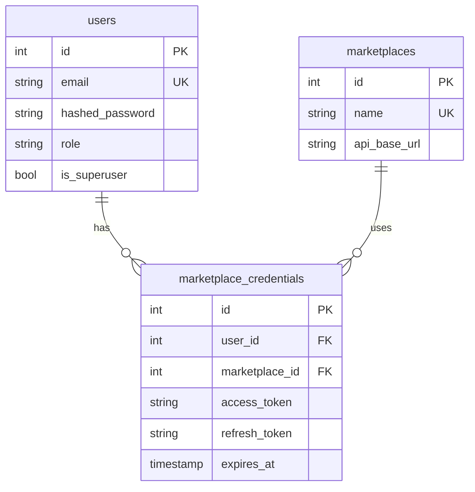
```mermaid
erDiagram
    users {
        int id PK
        string email UK
        string hashed_password
        string role
        bool is_superuser
    }

    marketplace_credentials {
        int id PK
        int user_id FK
        int marketplace_id FK
        string access_token
        string refresh_token
        timestamp expires_at
    }

    marketplaces {
        int id PK
        string name UK
        string api_base_url
    }

    users ||--o{ marketplace_credentials : has
    marketplaces ||--o{ marketplace_credentials : uses
```

### Product Catalog Schema

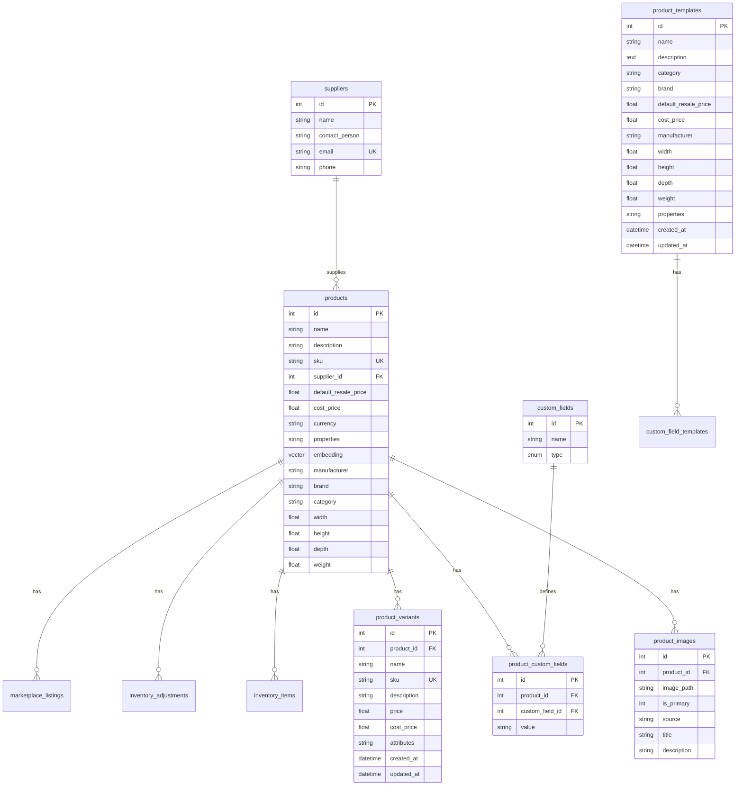
```mermaid
erDiagram
    products {
        int id PK
        string name
        string description
        string sku UK
        int supplier_id FK
        float default_resale_price
        float cost_price
        string currency
        string properties
        vector embedding
        string manufacturer
        string brand
        string category
        float width
        float height
        float depth
        float weight
    }

    suppliers {
        int id PK
        string name
        string contact_person
        string email UK
        string phone
    }

    product_images {
        int id PK
        int product_id FK
        string image_path
        int is_primary
        string source
        string title
        string description
    }

    product_variants {
        int id PK
        int product_id FK
        string name
        string sku UK
        string description
        float price
        float cost_price
        string attributes
        datetime created_at
        datetime updated_at
    }

    custom_fields {
        int id PK
        string name
        enum type
    }

    product_custom_fields {
        int id PK
        int product_id FK
        int custom_field_id FK
        string value
    }

    product_templates {
        int id PK
        string name
        text description
        string category
        string brand
        float default_resale_price
        float cost_price
        string manufacturer
        float width
        float height
        float depth
        float weight
        string properties
        datetime created_at
        datetime updated_at
    }

    products ||--o{ product_images : has
    products ||--o{ product_variants : has
    products ||--o{ product_custom_fields : has
    products ||--o{ inventory_items : has
    products ||--o{ inventory_adjustments : has
    products ||--o{ marketplace_listings : has
    suppliers ||--o{ products : supplies
    custom_fields ||--o{ product_custom_fields : defines
    product_templates ||--o{ custom_field_templates : has
```

### Inventory Management Schema

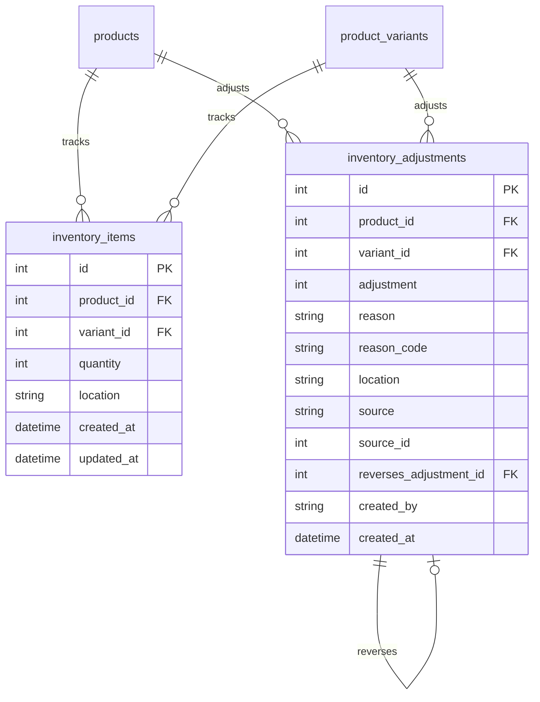
```mermaid
erDiagram
    inventory_items {
        int id PK
        int product_id FK
        int variant_id FK
        int quantity
        string location
        datetime created_at
        datetime updated_at
    }

    inventory_adjustments {
        int id PK
        int product_id FK
        int variant_id FK
        int adjustment
        string reason
        string reason_code
        string location
        string source
        int source_id
        int reverses_adjustment_id FK
        string created_by
        datetime created_at
    }

    products ||--o{ inventory_items : tracks
    products ||--o{ inventory_adjustments : adjusts
    product_variants ||--o{ inventory_items : tracks
    product_variants ||--o{ inventory_adjustments : adjusts
    inventory_adjustments ||--o| inventory_adjustments : reverses
```

**Stock-movement reason codes & reversibility**

Every adjustment carries a typed `reason_code` (a `String`, not a PG enum, so
adding a code is a single migration) recording _why_ stock moved, plus a
`location` mirroring `inventory_items.location` so the shrinkage report can
answer "where am I bleeding stock?" per location. Reason codes split into two
families:

- **Operator-initiated** (`shrinkage`, `recount`, `damage`, `theft`, `manual`,
  `correction`, `other`) — entered by a human via the adjustment / count
  workflow (`correction` is also the code a reversal books).
- **System-initiated** (`sale`, `cancellation`, `return`, `purchase`,
  `transfer`, `marketplace_sync`) — written by an order, PO, transfer, or sync
  lifecycle that owns its own correction path.

Adjustments additionally carry a structured **`source`** (machine origin key:
`purchase_order` / `stock_transfer` / `sales_order` / `inventory_count` /
`bundle_assembly` / `marketplace_sync` / `adjustment_reversal`) and
**`source_id`** (the originating entity's id). Unlike `reason_code`, `source`
is not CHECK-constrained — it is an open set that grows with new write paths.
It lets the stock-history dialog and the audit page deep-link an adjustment to
its origin (the PO / transfer / order / count) without parsing the localized
`reason` text. Both are NULL on legacy and manual rows.

`POST /api/v1/reports/inventory-adjustments/{id}/reverse` undoes an adjustment
by booking an **equal-and-opposite `correction`** row, linked back to the
original via the self-referential `reverses_adjustment_id` foreign key (a unique
constraint enforces at most one reversal per row, which makes reversing
**idempotent** — a second attempt returns `409`). Only the operator-initiated
codes are reversible from the audit log; the system-initiated codes (and a
`correction` row itself) are deliberately excluded, since reversing them would
desync stock from the order/PO/transfer that owns it.

### Stock Transfer Schema

Stock transfers model movements of inventory between locations under an explicit
state machine. Ship decrements the source location's `inventory_items` row;
receive increments the destination's. Both transitions also write an
`inventory_adjustment` audit row.

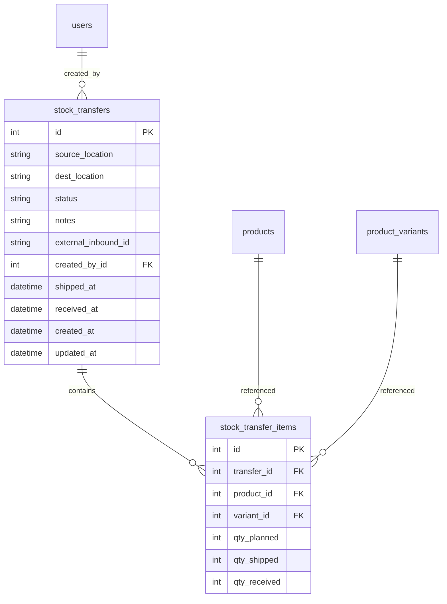
```mermaid
erDiagram
    stock_transfers {
        int id PK
        string source_location
        string dest_location
        string status
        string notes
        string external_inbound_id
        int created_by_id FK
        datetime shipped_at
        datetime received_at
        datetime created_at
        datetime updated_at
    }

    stock_transfer_items {
        int id PK
        int transfer_id FK
        int product_id FK
        int variant_id FK
        int qty_planned
        int qty_shipped
        int qty_received
    }

    stock_transfers ||--o{ stock_transfer_items : contains
    products ||--o{ stock_transfer_items : referenced
    product_variants ||--o{ stock_transfer_items : referenced
    users ||--o{ stock_transfers : created_by
```

### Order Processing Schema

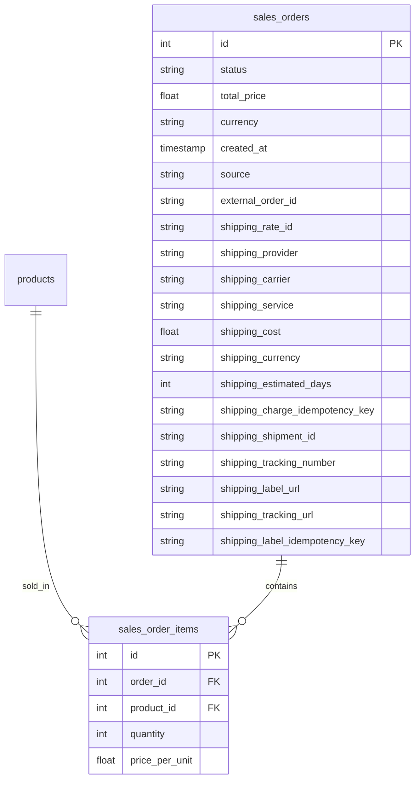
```mermaid
erDiagram
    sales_orders {
        int id PK
        string status
        float total_price
        string currency
        timestamp created_at
        string source
        string external_order_id
        string shipping_rate_id
        string shipping_provider
        string shipping_carrier
        string shipping_service
        float shipping_cost
        string shipping_currency
        int shipping_estimated_days
        string shipping_charge_idempotency_key
        string shipping_shipment_id
        string shipping_tracking_number
        string shipping_label_url
        string shipping_tracking_url
        string shipping_label_idempotency_key
    }

    sales_order_items {
        int id PK
        int order_id FK
        int product_id FK
        int quantity
        float price_per_unit
    }

    products ||--o{ sales_order_items : sold_in
    sales_orders ||--o{ sales_order_items : contains
```

### Currency / FX Schema

Fulcrum supports multiple currencies so figures sourced or sold outside the
primary MXN market stay unambiguous. Each product carries a native pricing
`currency` (ISO 4217, defaulting to `MXN`); a product sourced/listed in USD
(e.g. an Alibaba import) carries `USD` so its cost/price figures are clear and
can be converted to MXN at the rate on the transaction date.

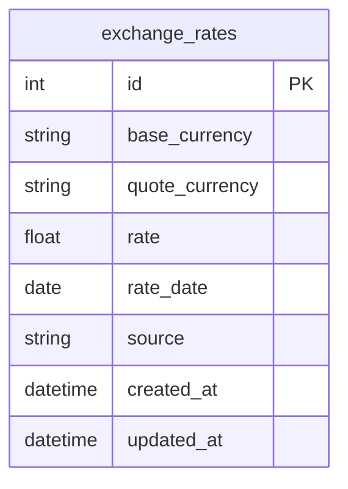
```mermaid
erDiagram
    exchange_rates {
        int id PK
        string base_currency
        string quote_currency
        float rate
        date rate_date
        string source
        datetime created_at
        datetime updated_at
    }
```

**Key Concepts**:

- `rate` is read as: 1 unit of `base_currency` = `rate` units of
  `quote_currency` (e.g. base `USD`, quote `MXN`, rate `17.10` → US$1 =
  MX$17.10).
- A unique constraint on `(base_currency, quote_currency, rate_date)` keeps one
  rate per pair per day; re-recording the same day upserts in place.
- `source` records provenance (`manual`, `banxico`, `ecb`, …) so a manual
  override is distinguishable from a fed rate.
- Conversions look up the **most-recent rate on or before** the transaction
  date, so historical orders convert at the rate that was true on their date.

The `/api/v1/currency` endpoints expose this table: `GET`/`POST /currency/rates`
list and record rates, and `GET /currency/convert` converts an amount
historically. Conversion logic lives in `services/currency_service.py`. On the
frontend, the `MoneyPipe` renders every amount with an unambiguous,
currency-tagged symbol (`MX$`, `US$`, …) driven by the record's own currency
code, so a peso and a dollar never both collapse to a bare `$`.

### Marketplace Integration Schema

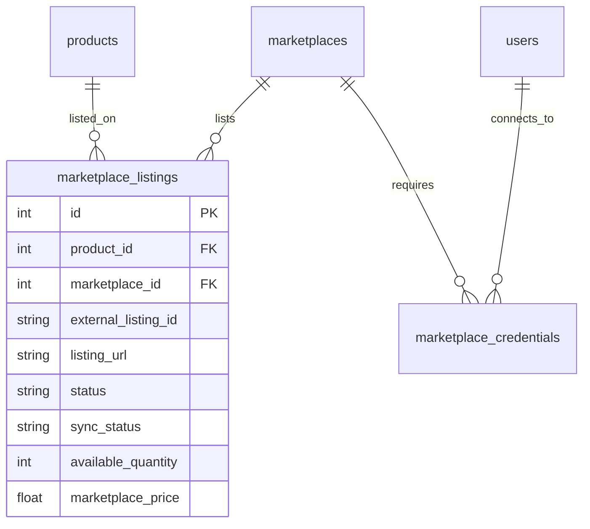
```mermaid
erDiagram
    marketplace_listings {
        int id PK
        int product_id FK
        int marketplace_id FK
        string external_listing_id
        string listing_url
        string status
        string sync_status
        int available_quantity
        float marketplace_price
    }

    marketplaces ||--o{ marketplace_listings : lists
    products ||--o{ marketplace_listings : listed_on
    users ||--o{ marketplace_credentials : connects_to
    marketplaces ||--o{ marketplace_credentials : requires
```

### Bundle / Kitting Schema

Bundles are virtual products composed of other products. This enables
kit-building and combo-pack functionality.

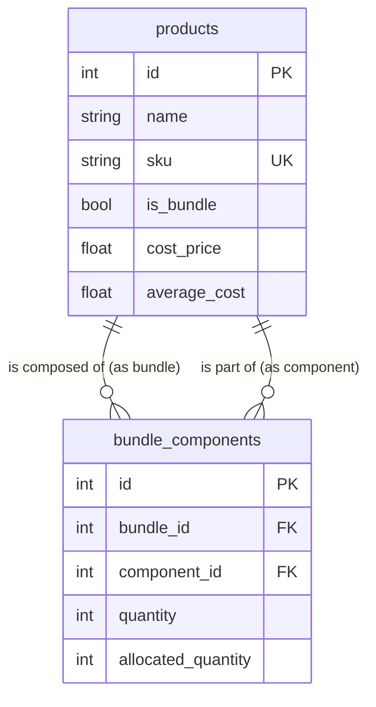
```mermaid
erDiagram
    products {
        int id PK
        string name
        string sku UK
        bool is_bundle
        float cost_price
        float average_cost
    }

    bundle_components {
        int id PK
        int bundle_id FK
        int component_id FK
        int quantity
        int allocated_quantity
    }

    products ||--o{ bundle_components : "is composed of (as bundle)"
    products ||--o{ bundle_components : "is part of (as component)"
```

**Key Concepts**:

- `is_bundle`: Flag on products table indicating if product is a bundle.
- `bundle_components`: Junction table linking bundle products to their
  components.
- `quantity`: How many of the component are in one bundle unit.
- `allocated_quantity`: Stock reserved for pre-built kits.

### Purchase Order Schema

Purchase Orders track inbound inventory from suppliers with full line item
details and cost tracking.

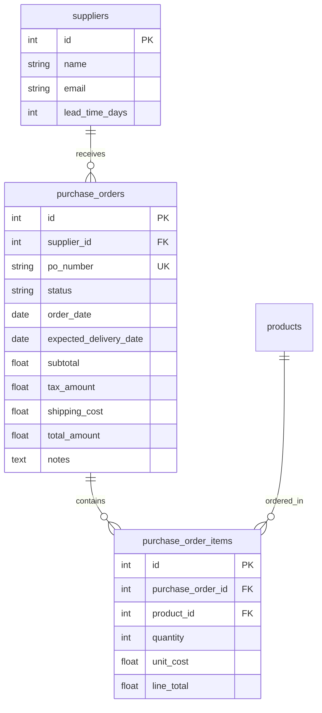
```mermaid
erDiagram
    purchase_orders {
        int id PK
        int supplier_id FK
        string po_number UK
        string status
        date order_date
        date expected_delivery_date
        float subtotal
        float tax_amount
        float shipping_cost
        float total_amount
        text notes
    }

    purchase_order_items {
        int id PK
        int purchase_order_id FK
        int product_id FK
        int quantity
        float unit_cost
        float line_total
    }

    suppliers {
        int id PK
        string name
        string email
        int lead_time_days
    }

    suppliers ||--o{ purchase_orders : receives
    purchase_orders ||--o{ purchase_order_items : contains
    products ||--o{ purchase_order_items : ordered_in
```

**Key Concepts**:

- `status`: Draft, Ordered, Received.
- `unit_cost`: Cost per item on this PO (may differ from product's
  `cost_price`).
- When PO is received, inventory is adjusted and `average_cost` is recalculated.

### Marketing Operations Schema

Manages multi-channel campaigns, events, and performance tracking.

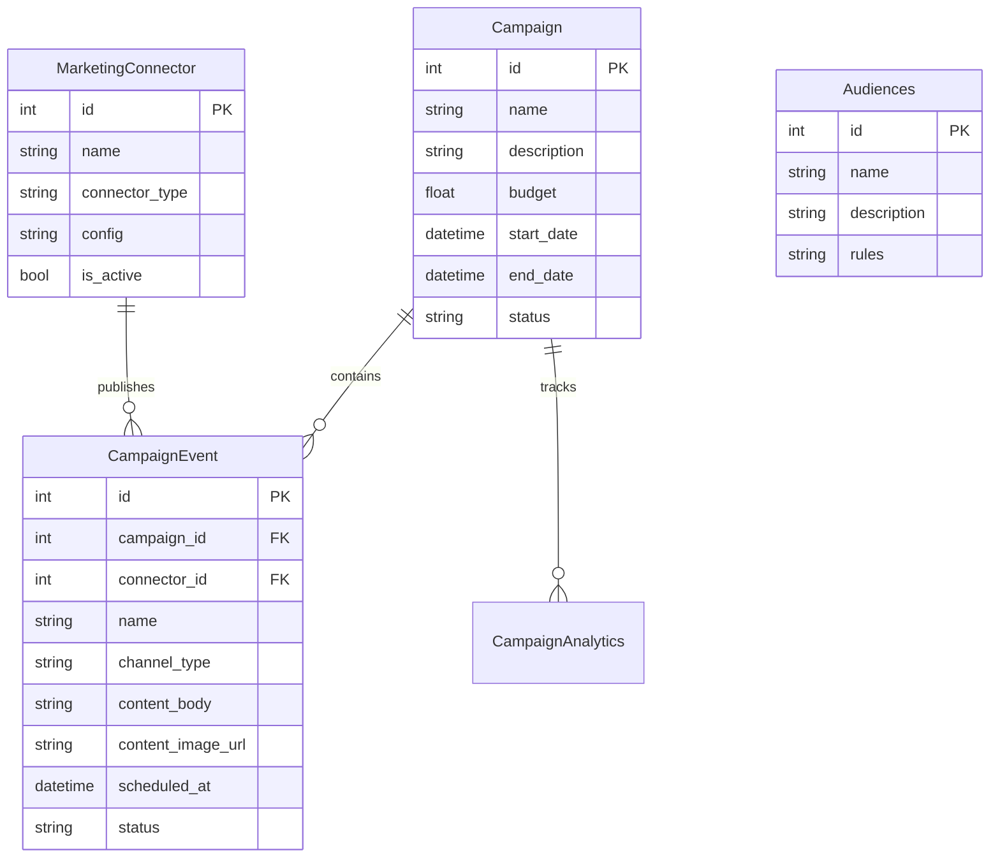
```mermaid
erDiagram
    Campaign {
        int id PK
        string name
        string description
        float budget
        datetime start_date
        datetime end_date
        string status
    }

    CampaignEvent {
        int id PK
        int campaign_id FK
        int connector_id FK
        string name
        string channel_type
        string content_body
        string content_image_url
        datetime scheduled_at
        string status
    }

    MarketingConnector {
        int id PK
        string name
        string connector_type
        string config
        bool is_active
    }

    Audiences {
        int id PK
        string name
        string description
        string rules
    }

    Campaign ||--o{ CampaignEvent : contains
    MarketingConnector ||--o{ CampaignEvent : publishes
    Campaign ||--o{ CampaignAnalytics : tracks
```

### Expense Tracking Schema

Operating expenses for profitability analysis beyond COGS.

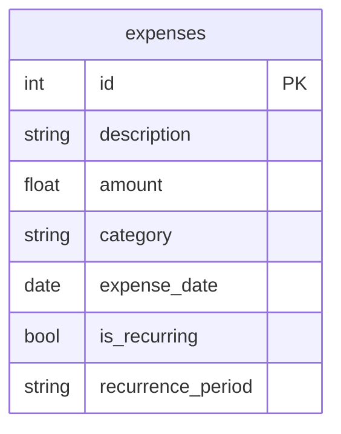
```mermaid
erDiagram
    expenses {
        int id PK
        string description
        float amount
        string category
        date expense_date
        bool is_recurring
        string recurrence_period
    }
```

**Categories**: Advertising, Software, Shipping, Labor, Other.

### Sync and Audit Trail Schema

Tracks external sync operations and provides a complete audit trail for all
entity changes with source attribution.

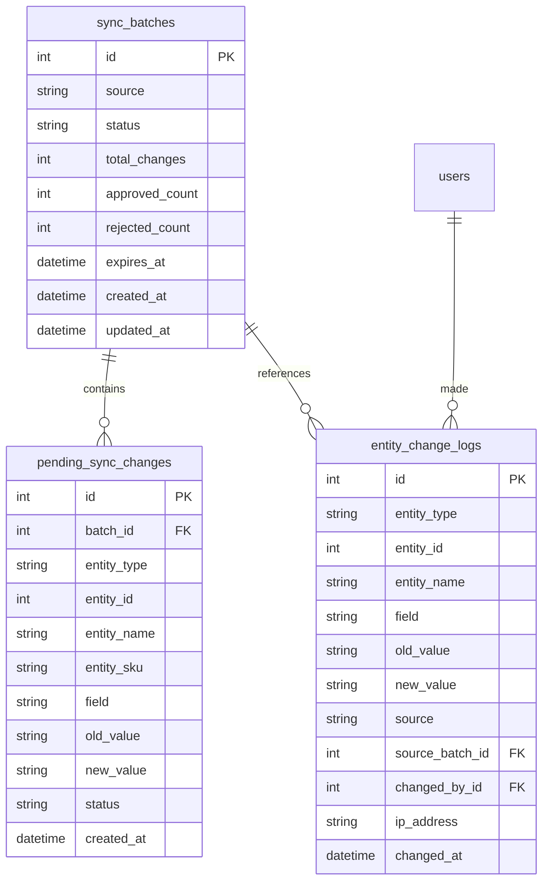
```mermaid
erDiagram
    sync_batches {
        int id PK
        string source
        string status
        int total_changes
        int approved_count
        int rejected_count
        datetime expires_at
        datetime created_at
        datetime updated_at
    }

    pending_sync_changes {
        int id PK
        int batch_id FK
        string entity_type
        int entity_id
        string entity_name
        string entity_sku
        string field
        string old_value
        string new_value
        string status
        datetime created_at
    }

    entity_change_logs {
        int id PK
        string entity_type
        int entity_id
        string entity_name
        string field
        string old_value
        string new_value
        string source
        int source_batch_id FK
        int changed_by_id FK
        string ip_address
        datetime changed_at
    }

    sync_batches ||--o{ pending_sync_changes : contains
    sync_batches ||--o{ entity_change_logs : references
    users ||--o{ entity_change_logs : made
```

**Key Concepts**:

- **SyncBatch**: Groups import operations from Google Sheets or other sources.
  - `source`: Origin of changes (google_sheets, csv_import, etc.)
  - `status`: pending, partially_applied, completed
  - `expires_at`: Auto-cleanup for old batches (30 days)

- **PendingSyncChange**: Temporary staging for changes awaiting approval.
  - Deleted after batch is fully processed
  - Records entity info for display without product lookup

- **EntityChangeLog**: Permanent audit trail for ALL changes.
  - `source`: sheets_import, direct_edit, api
  - Retained indefinitely for compliance/auditing
  - Tracks who made the change and from where

## Key Relationships

### One-to-Many Relationships

- **users** → **marketplace_credentials** (one user can have credentials for
  multiple marketplaces)
- **suppliers** → **products** (one supplier can supply many products)
- **products** → **product_images** (one product can have many images)
- **products** → **product_variants** (one product can have many variants)
- **products** → **product_custom_fields** (one product can have many custom
  field values)
- **products** → **inventory_items** (one product can have inventory in multiple
  locations)
- **products** → **inventory_adjustments** (one product can have many inventory
  adjustments)
- **products** → **sales_order_items** (one product can appear in many order
  items)
- **sales_orders** → **sales_order_items** (one order can contain many items)

### Many-to-Many Relationships

The system uses junction tables to handle many-to-many relationships:

- **marketplace_credentials** connects **users** and **marketplaces**
- **product_custom_fields** connects **products** and **custom_fields**
- **marketplace_listings** connects **products** and **marketplaces**

## Design Principles

The database schema follows these key principles:

1. **Normalization**: Tables are normalized to reduce redundancy and maintain
   data integrity.
2. **Referential Integrity**: Foreign key constraints ensure relationships
   between tables are maintained.
3. **Cascading Deletes**: Where appropriate, cascading deletes ensure related
   data is cleaned up properly when parent records are removed.
4. **Indexing**: Critical columns (primary keys, foreign keys, unique
   constraints) are indexed for performance.
5. **Audit Trail**: The inventory adjustment table maintains a complete history
   of all stock changes.
