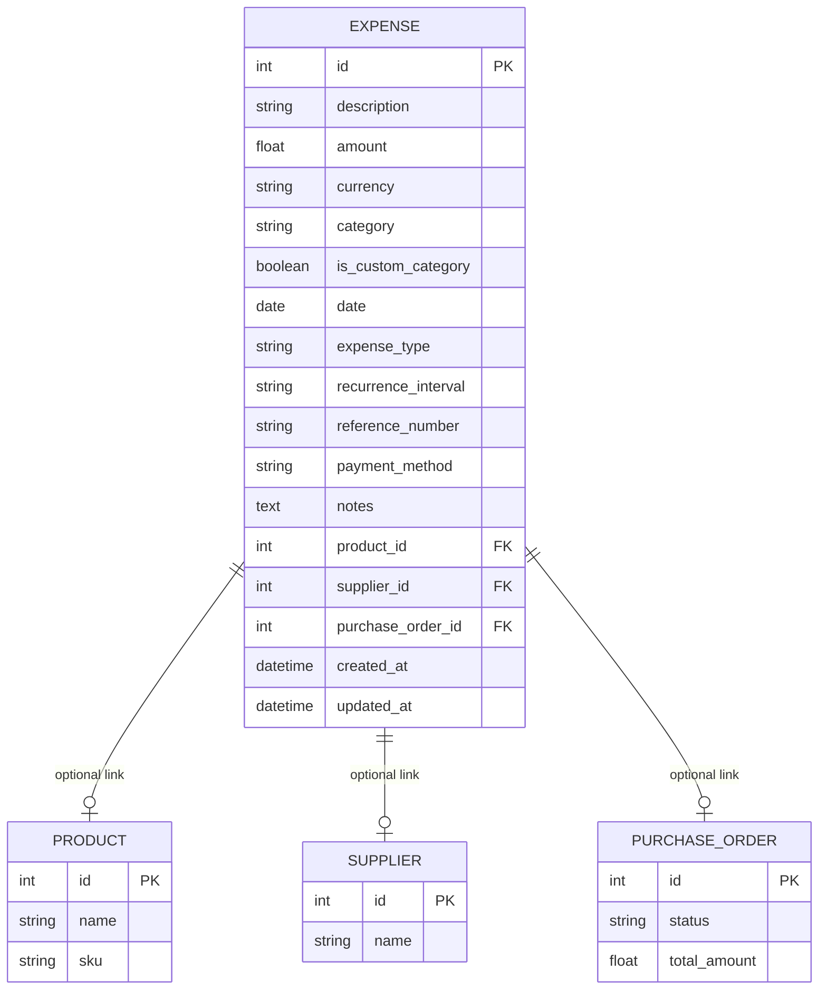

# Expense Data Model

This document describes the database schema for the expense tracking system.

## Overview

The Expense model tracks all business expenses, supporting both one-time and
recurring costs with flexible categorization.

## Entity Relationship Diagram

## Field Descriptions

| Field                 | Type    | Description                                |
| --------------------- | ------- | ------------------------------------------ |
| `id`                  | Integer | Primary key                                |
| `description`         | String  | What the expense is for                    |
| `amount`              | Float   | Cost amount                                |
| `currency`            | String  | Currency code (USD, EUR, etc.)             |
| `category`            | String  | Expense category                           |
| `is_custom_category`  | Boolean | True if user-created category              |
| `date`                | Date    | When expense occurred                      |
| `expense_type`        | String  | "one_time" or "recurring"                  |
| `recurrence_interval` | String  | "weekly", "monthly", "quarterly", "yearly" |
| `reference_number`    | String  | Invoice/receipt reference                  |
| `payment_method`      | String  | "cash", "card", "transfer", "check"        |
| `notes`               | Text    | Additional details                         |

## Relationships

- **Product**: Optionally link expense to a product (e.g., marketing for SKU)
- **Supplier**: Optionally link expense to a supplier
- **Purchase Order**: Optionally link expense to a PO (e.g., shipping costs)

## API Endpoints

| Method | Endpoint                      | Description                  |
| ------ | ----------------------------- | ---------------------------- |
| GET    | `/api/v1/expenses/`           | List expenses (with filters) |
| GET    | `/api/v1/expenses/summary`    | Get expense totals           |
| GET    | `/api/v1/expenses/categories` | List available categories    |
| POST   | `/api/v1/expenses/`           | Create expense               |
| PUT    | `/api/v1/expenses/{id}`       | Update expense               |
| DELETE | `/api/v1/expenses/{id}`       | Delete expense               |
