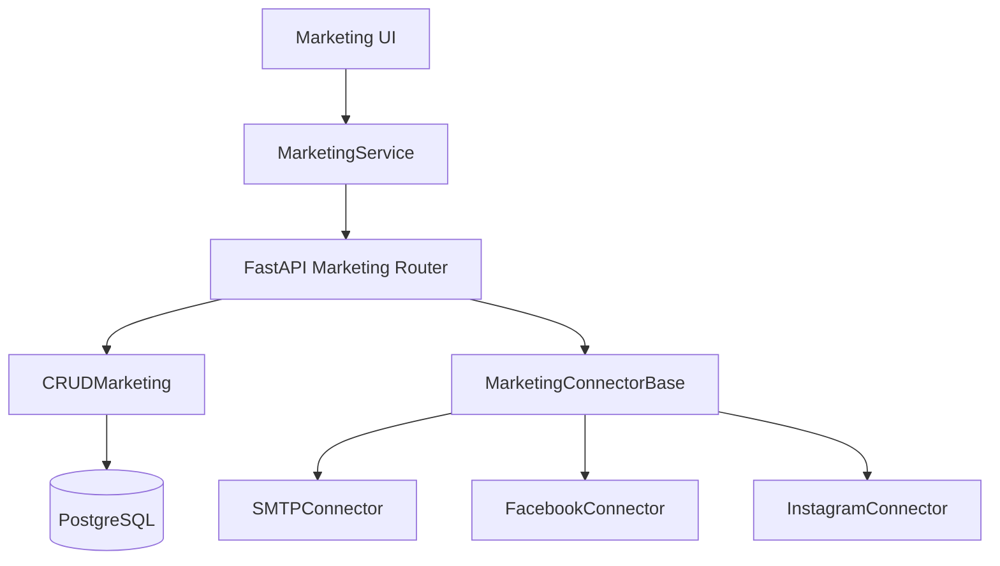
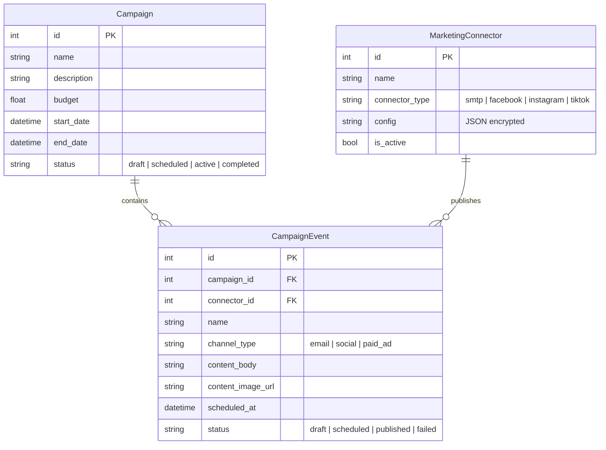

# Marketing Architecture

The Marketing module is designed to manage multi-channel campaigns, schedule
events (posts, emails), and track performance. It uses a flexible connector
system to integrate with various platforms.

## System Overview

## Data Model

The core of the marketing system revolves around **Campaigns** and **Events**.

- **Campaign**: A high-level container for marketing efforts with a budget,
  goal, and date range.
- **CampaignEvent**: An individual unit of work (an email blast, a social post)
  tied to a campaign or standalone (Quick Post).
- **MarketingConnector**: A configuration for an external channel (e.g., SMTP
  settings, Social API keys).
- **Audience**: A segment of users or customers targeted by a campaign.

### Database Schema

## Key Workflows

### 1. Creating a Campaign

Users use the **Campaign Wizard** to define goals, link products, and schedule
events. The wizard ensures that products are linked as `CampaignProduct`
entities for tracking.

### 2. Quick Posts

Quick Posts are `CampaignEvent` records with `campaign_id` as `null`. They allow
for rapid engagement without formal planning.

### 3. Scheduling & Rescheduling

The **Marketing Calendar** (FullCalendar) interacts with the API to update
`scheduled_at` timestamps. Drag-and-drop actions trigger patch requests to the
backend.

### 4. Publishing

When an event's `scheduled_at` time arrives (or when manually triggered via
"Post Now"), the backend uses the associated `MarketingConnector` to execute the
platform-specific API call.

- **Email**: Sent via `SMTPConnector` using `aiosmtplib`.
- **Social**: Dispatched to marketplace/social APIs via the connector framework.

## Performance Tracking

Analytics are tracked at both the Campaign and Event levels, capturing metrics
like impressions, clicks, and conversions. These are stored in
`CampaignAnalytics` and `EventAnalytics` tables for reporting.
