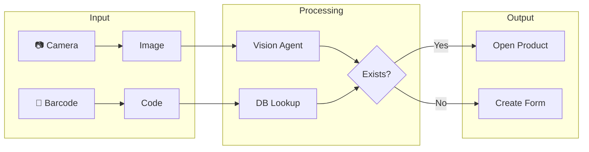
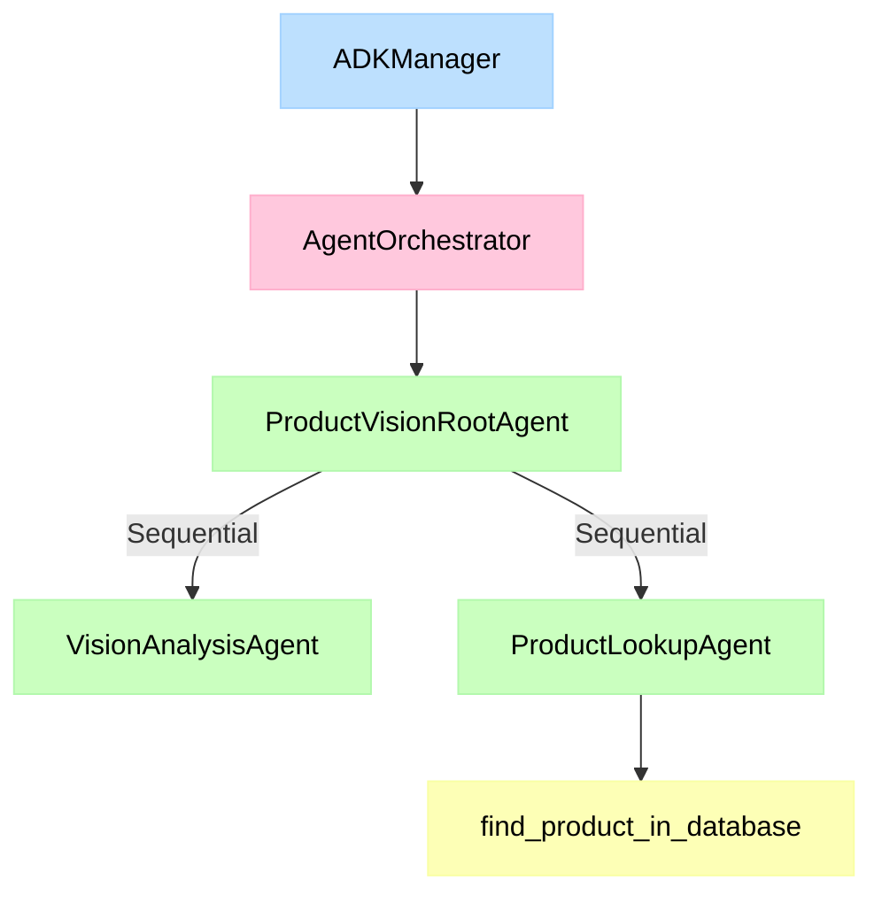

# AI Integration Guide

Fulcrum leverages AI to streamline product management using multiple AI
providers (Google Gemini, OpenAI, Anthropic Claude, Alibaba Qwen).

## Quick Start

### 1. Get an API Key

Go to [Google AI Studio](https://aistudio.google.com/) and create an API key.

### 2. Configure in Fulcrum

1. Navigate to **Settings → AI & Agents**
2. Toggle **Enable AI Features** ON
3. Select **Google** as the provider
4. Paste your API key
5. Click **Save**

### 3. Use the Scanner

1. Go to **Products → Product Hub**
2. Click the **Scan** button (camera icon)
3. Capture a product image or scan a barcode

---

## Features

### Product Scanner (Vision Agent)

The product scanner analyzes images to identify products automatically.



**Modes:**

- **AI Mode:** Captures image → AI analysis → Pre-fills product form
- **Manual Mode:** Camera capture → Blank form for manual entry
- **Barcode Scanner:** Camera or Bluetooth scanner → Database lookup

### Barcode & QR Code Generation

Products automatically get CODE128 barcodes and QR codes:

- **Barcode:** Format `STORE-{SKU}` for internal tracking
- **QR Code:** Links to your store domain (configured in Settings > Marketing)

---

## Supported Providers

| Provider   | Default Model               | API Key Source                |
|------------|------------------------------|-------------------------------|
| Google Gemini | gemini-3.0-flash            | [AI Studio](https://aistudio.google.com/) |
| OpenAI     | gpt-4o                      | [OpenAI](https://platform.openai.com/) |
| Anthropic  | claude-3-5-sonnet-20240620  | [Anthropic](https://console.anthropic.com/) |
| Qwen       | qwen-vl-max                 | [DashScope](https://dashscope.console.aliyun.com/) |

---

## ADK Architecture

The AI system uses Google's Agent Development Kit (ADK) with a modular design.



### Directory Structure

```
backend/src/services/adk/
├── manager.py            # Settings & API key management
├── orchestrator.py       # Workflow coordination
├── agents/
│   └── product_vision/
│       ├── root_agent.py # Entry point
│       ├── vision_agent.py # Image analysis
│       └── prompts/system.md
└── tools/
    ├── search_tool.py    # Google Search
    ├── fulcrum_tool.py   # Product DB lookup
    ├── inventory_tool.py # Stock queries (future)
    ├── supplier_tool.py  # Supplier lookup (future)
    └── pricing_tool.py   # Margins (future)
```

### Available Tools

| Tool | Used By | Description |
|------|---------|-------------|
| `SearchTool` | VisionAgent | Web search for product specs |
| `FulcrumProductTool` | VisionAgent | Check if product exists in DB |
| `InventoryTool` | Future agents | Stock level queries |
| `SupplierTool` | Future agents | Find suppliers |
| `PricingTool` | Future agents | Margin calculations |

---

## Store Domain (QR Codes)

Configure your public domain in **Settings → Marketing → Store Brand**:

- **Store Name:** Your display name
- **Store Domain:** Base URL for QR codes (e.g., `https://mystore.com`)

QR codes generate URLs like: `https://mystore.com/qr/{product_id}`

---

## Testing

```bash
# Unit tests for ADK tools
docker compose exec backend python -m pytest tests/test_adk_tools.py -v

# Integration tests for agents
docker compose exec backend python -m pytest tests/test_adk_integration.py -v

# Full test suite
docker compose exec backend python -m pytest tests/ -v
```

---

## Troubleshooting

### "AI features not available"

- Ensure `GOOGLE_API_KEY` is set or configured in Settings
- Check that `google-adk` package is installed

### Scanner returns empty results

- Use well-lit images with clear product visibility
- Try different angles if recognition fails
- Fall back to barcode scanning for accuracy

### QR codes show wrong URL

- Verify **Store Domain** is set in Settings → Marketing
- Rebuild product after changing domain
