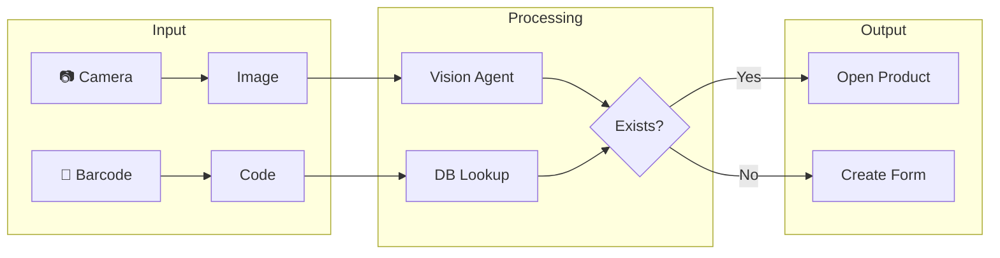
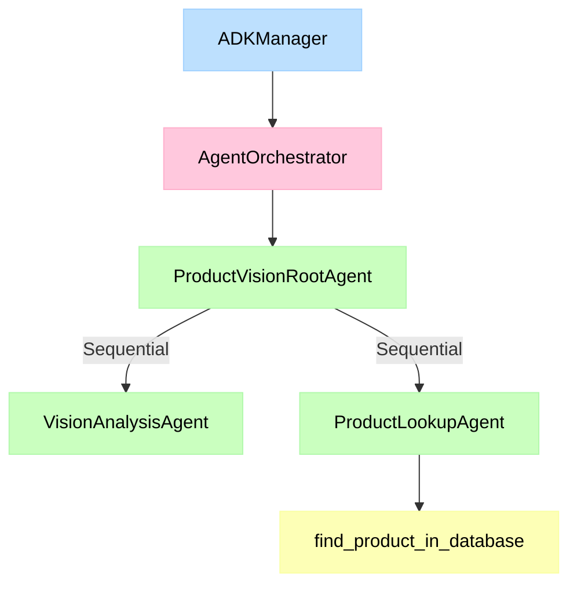
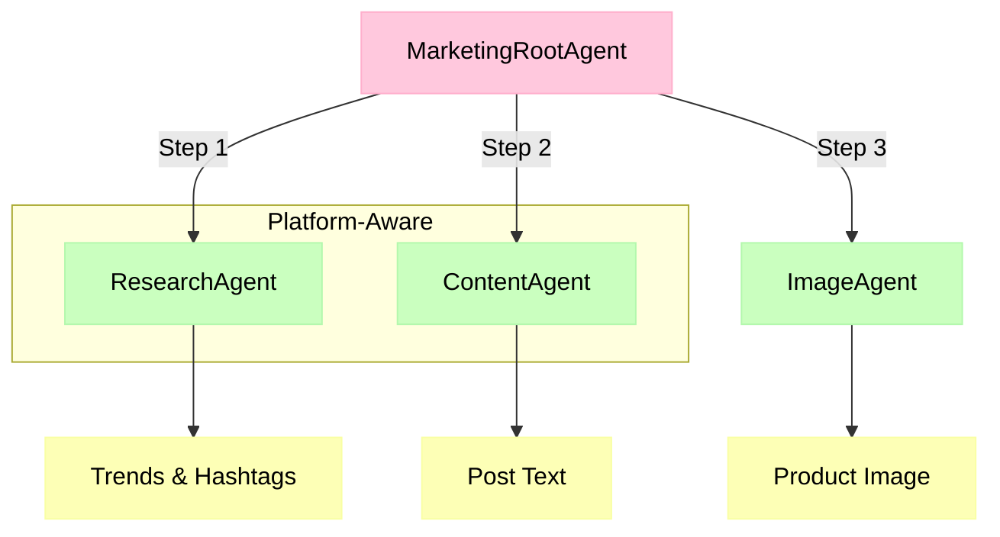

# AI Integration Guide

Fulcrum leverages AI to streamline product management using multiple AI
providers (Google Gemini, OpenAI, Anthropic Claude, Alibaba Qwen).

## Quick Start

### 1. Get an API Key

Go to [Google AI Studio](https://aistudio.google.com/) and create an API key.

### 2. Configure in Fulcrum

1. Navigate to **Settings → AI & Agents**
2. Toggle **Enable AI Features** ON
3. Select **Google** as the provider
4. Paste your API key
5. Click **Save**

### 3. Use the Scanner

1. Go to **Products → Product Hub**
2. Click the **Scan** button (camera icon)
3. Capture a product image or scan a barcode

---

## Features

### Product Scanner (Vision Agent)

The product scanner analyzes images to identify products automatically.



**Modes:**

- **AI Mode:** Captures image → AI analysis → Pre-fills product form
- **Manual Mode:** Camera capture → Blank form for manual entry
- **Barcode Scanner:** Camera or Bluetooth scanner → Database lookup

### Barcode & QR Code Generation

Products automatically get CODE128 barcodes and QR codes:

- **Barcode:** Format `STORE-{SKU}` for internal tracking
- **QR Code:** Links to your store domain (configured in Settings > Marketing)

### Marketing Content Generation

AI-powered content creation for social media marketing.

**Features:**

- **Tone Presets:** Professional, Casual, Viral/Hype, Luxury, or Custom
- **Editable Prompts:** Pre-filled based on tone, fully customizable
- **Image Generation:** Creates product images using Gemini's native image
  output
- **Draft Persistence:** AI metadata (tone, prompt, model) saved in
  `content_json`

**API Endpoints:**

| Endpoint                             | Method | Description                    |
| ------------------------------------ | ------ | ------------------------------ |
| `/api/v1/marketing/tone-presets`     | GET    | List available tone presets    |
| `/api/v1/marketing/generate-content` | POST   | Generate content via AI agents |

**`content_json` Schema:**

```json
{
  "ai_tone": "Professional",
  "ai_prompt": "Write a professional post...",
  "ai_model": "gemini-2.0-flash-exp",
  "generated_at": "2026-01-05T..."
}
```

### AI Description Generation

Generate product descriptions automatically using AI.

**API Endpoint:**

| Endpoint                          | Method | Description                  |
| --------------------------------- | ------ | ---------------------------- |
| `/api/v1/ai/generate-description` | POST   | Generate product description |

**Request:**

```json
{
  "product_name": "Yoga Mat Non-Slip Cork",
  "context": "Brand: EcoMat, Category: Fitness",
  "tone": "Professional",
  "length": "medium"
}
```

**Response:**

```json
{
  "description": "Elevate your yoga practice with the EcoMat Non-Slip Cork Yoga Mat...",
  "seo_keywords": ["yoga mat", "cork mat", "eco-friendly"],
  "tone_used": "Professional"
}
```

**Frontend Integration:**

- Located next to the Description field in the Product Form
- Click the "AI" button (sparkle icon) to generate
- Shows loading spinner while processing
- Auto-populates the description textarea

### Invoice Parser Service

Parse invoices using AI multimodal vision to extract structured data and match
against existing Purchase Orders.

**API Endpoints:**

| Endpoint                                                | Method | Description                                |
| ------------------------------------------------------- | ------ | ------------------------------------------ |
| `/api/v1/purchase-orders/parse-document`                | POST   | **Unified** - Parse and smart-match PO     |
| `/api/v1/purchase-orders/{id}/invoices/parse-and-match` | POST   | Parse invoice for specific PO (deprecated) |

**Unified Endpoint Behavior:**

The `/parse-document` endpoint intelligently determines whether to create a new
PO or match against an existing one:

- `mode: "create"` - No matching PO found, use extracted data to create new PO
- `mode: "match"` - Found matching PO by vendor + items, returns comparison

**Request:** Multipart form with `file` field, optional `target_po_id` query
param

**Supported File Types:** PDF, PNG, JPG, JPEG, HTML, TXT

**Response (mode: match):**

```json
{
  "mode": "match",
  "vendor_name": "Tech Supplies Direct",
  "invoice_number": "INV-2026-001",
  "matched_po_id": 123,
  "matched_po_number": "PO-123",
  "matched_supplier_name": "Tech Supplies Direct",
  "match_confidence": 0.85,
  "matches": [
    {
      "po_item_id": 456,
      "po_description": "1TB NVMe SSD",
      "invoice_description": "1TB NVMe SSD Drive",
      "match_status": "matched",
      "confidence": 0.95
    }
  ],
  "unmatched_po_items": [],
  "unmatched_invoice_items": []
}
```

**Response (mode: create):**

```json
{
  "mode": "create",
  "vendor_name": "New Supplier Co",
  "items": [{ "sku": "PROD-001", "description": "Widget A", "quantity": 10 }],
  "confidence": 0.92
}
```

**Match Statuses:**

- `matched` - Exact match on quantity and price
- `quantity_diff` - Quantity differs from PO
- `price_diff` - Unit cost differs from PO
- `unmatched` - No matching PO item found

---

## Supported Providers

| Provider      | Default Model              | API Key Source                                     |
| ------------- | -------------------------- | -------------------------------------------------- |
| Google Gemini | gemini-3.0-flash           | [AI Studio](https://aistudio.google.com/)          |
| OpenAI        | gpt-4o                     | [OpenAI](https://platform.openai.com/)             |
| Anthropic     | claude-3-5-sonnet-20240620 | [Anthropic](https://console.anthropic.com/)        |
| Qwen          | qwen-vl-max                | [DashScope](https://dashscope.console.aliyun.com/) |

---

## ADK Architecture

The AI system uses Google's Agent Development Kit (ADK) with a modular design.

### Product Vision Agent



### Marketing Content Agent



**Flow:**

1. **ResearchAgent** - Searches trends, hashtags, and viral angles for the
   product
2. **ContentAgent** - Writes platform-specific content (Twitter: 280 chars +
   hashtags, Instagram: longer + more hashtags)
3. **ImageAgent** - Generates product images using Gemini's native image output

### Directory Structure

```
backend/src/services/adk/
├── manager.py            # Settings & API key management
├── orchestrator.py       # Workflow coordination
├── agents/
│   ├── product_vision/
│   │   ├── root_agent.py # Entry point
│   │   ├── vision_agent.py # Image analysis
│   │   └── prompts/system.md
│   ├── marketing/
│   │   ├── description_agent.py # Product description generation
│   │   └── prompts/description.md
│   └── invoice/
│       ├── invoice_parser_agent.py # Invoice parsing (multimodal)
│       └── prompts/invoice_extraction.md
└── tools/
    ├── search_tool.py    # Google Search
    ├── fulcrum_tool.py   # Product DB lookup
    ├── inventory_tool.py # Stock queries (future)
    ├── supplier_tool.py  # Supplier lookup (future)
    └── pricing_tool.py   # Margins (future)
```

### Available Tools

| Tool                 | Used By       | Description                   |
| -------------------- | ------------- | ----------------------------- |
| `SearchTool`         | VisionAgent   | Web search for product specs  |
| `FulcrumProductTool` | VisionAgent   | Check if product exists in DB |
| `InventoryTool`      | Future agents | Stock level queries           |
| `SupplierTool`       | Future agents | Find suppliers                |
| `PricingTool`        | Future agents | Margin calculations           |

---

## Store Domain (QR Codes)

Configure your public domain in **Settings → Marketing → Store Brand**:

- **Store Name:** Your display name
- **Store Domain:** Base URL for QR codes (e.g., `https://mystore.com`)

QR codes generate URLs like: `https://mystore.com/qr/{product_id}`

---

## Testing

```bash
# Unit tests for ADK tools
docker compose exec backend python -m pytest tests/test_adk_tools.py -v

# Integration tests for agents
docker compose exec backend python -m pytest tests/test_adk_integration.py -v

# Full test suite
docker compose exec backend python -m pytest tests/ -v
```

---

## Troubleshooting

### "AI features not available"

- Ensure `GOOGLE_API_KEY` is set or configured in Settings
- Check that `google-adk` package is installed

### Scanner returns empty results

- Use well-lit images with clear product visibility
- Try different angles if recognition fails
- Fall back to barcode scanning for accuracy

### QR codes show wrong URL

- Verify **Store Domain** is set in Settings → Marketing
- Rebuild product after changing domain
