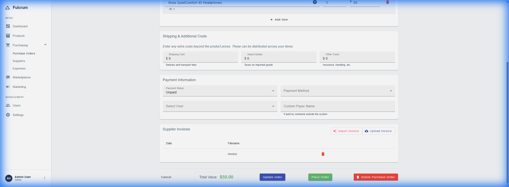

# User Guide: Suppliers & Purchase Orders

The **Suppliers** tab helps you manage your vendor relationships and track
inbound inventory through Purchase Orders (POs).

## Accessing Suppliers

Click **Purchasing > Suppliers** in the left sidebar.

## Managing Suppliers

### Supplier List Features

- **Sorting**: Click column headers (Supplier, Contact, Orders, Total Value) to
  sort the list.
- **KPIs**: View total number of suppliers at a glance.
- **Deep Linking**: Click the "X POs" button in the **Orders** column to view
  all purchase orders for that specific supplier.

### Adding a Supplier

1. Click **+ Add Supplier**.
2. Fill in the supplier details:
   - **Name**: Company or contact name.
   - **Contact Email**: For communication.
   - **Phone**: Optional.
   - **Address**: Optional shipping/billing address.
   - **Lead Time (Days)**: Average time from order to delivery.
3. Click **Save**.

### Supplier Details

Click on a supplier row or "Edit" button to view:

- Contact information.
- Associated products (if linked).
- Purchase order history.

## Purchase Orders

Purchase Orders track your inbound inventory from suppliers.

### Accessing Purchase Orders

Click **Purchasing > Purchase Orders** in the left sidebar.

### Purchase Order List Features

The PO list is designed for efficiency:

- **Sorting**: Click any column header (PO #, Supplier, Status, Total, Date) to
  sort.
- **Supplier Filter**: Use the "Supplier" dropdown to filter orders by a
  specific vendor.
- **Status Filter**: Filter by Draft, Ordered, Received, etc.
- **Date Range**: Use the presets (Today, This Week, Month to Date) to focus on
  recent activity.
- **KPI Summary**: View Total Orders, Pending count, Total Value, and Received
  Value at the top.

### Creating a Purchase Order

1. From the **Purchase Orders** screen, click **+ Create PO**.
2. Or from the **Suppliers** list, click **+ Add PO**.
3. Select the **Supplier** (if not pre-selected).
4. Add **Line Items**:
   - Search for products or add new ones.
   - Specify quantity and unit cost.
5. Review totals (Subtotal, Tax, Shipping, Total).
6. Set **Status**: Draft, Ordered, Received.
7. Click **Save**.

### PO Statuses

| Status   | Description                                        |
| -------- | -------------------------------------------------- |
| Draft    | PO is being prepared, not yet sent to supplier.    |
| Ordered  | PO has been sent/submitted to the supplier.        |
| Received | Goods have arrived and inventory has been updated. |

### Receiving Inventory

When goods arrive:

1. Open the PO.
2. Click **Mark as Received**.
3. The system automatically updates product stock quantities and recalculates
   average cost based on the new purchase price.

### Invoice Matching (AI-Powered)

When you receive an invoice from your supplier, Fulcrum can automatically match
it against your PO using AI.



#### How It Works

1. Open the PO you want to match an invoice against.
2. Scroll to the **Supplier Invoices** section.
3. Click **Import Invoice** (✨ sparkle icon).
4. Select your invoice file (PDF, Image, or HTML).
5. The AI extracts vendor, items, and costs automatically.
6. Review the matching results:
   - 🟢 **Matched** - Items match exactly
   - 🟡 **Diff** - Quantity or price differs
   - 🔴 **Unmatched** - Item not found in PO
7. Click **Apply Invoice Values** to update PO costs.
8. **Save** your PO to persist changes.

> **Note:** "Import Invoice" is only available for Draft/Ordered POs.

## Import PO vs. Create PO: What's the Difference?

Fulcrum offers two ways to create Purchase Orders from supplier documents:

| Feature | Import PO | Create PO + Import Invoice |
| ------- | --------- | -------------------------- |
| **Use When** | You have a supplier quote/invoice and want to create a NEW PO | You already have a PO and receive an invoice |
| **How** | PO List → Import PO → Upload document | Open PO → Supplier Invoices → Import Invoice |
| **Result** | Creates new PO with extracted data | Matches invoice to existing PO items |
| **Updates Cost** | Sets initial costs | Updates costs if different |

### Recommended Workflow

```
1. Create PO manually OR Import PO from supplier quote
   └─> Order sent to supplier → Status: Ordered

2. Goods arrive + Invoice received
   └─> Open PO → Import Invoice → Match & apply costs
   └─> Verify discrepancies (price changes, qty diffs)

3. Receive items
   └─> Mark as Received → Inventory updated
```

## Linking Products to Suppliers

You can associate products with specific suppliers for reorder tracking:

1. Go to **Products > [Product] > Edit**.
2. In the **Supplier Product** section, link to a supplier and specify their
   SKU.

---

## Testing Invoice Matching

Sample invoices are provided for testing both workflows:

**Location:** `backend/samples/purchase_orders/`

| File | Vendor | Best For |
| ---- | ------ | -------- |
| `tech_supplies_direct_po.html` | Tech Supplies Direct | Testing with electronics items |
| `home_essentials_po.html` | Home Essentials Co. | Testing with home goods |
| `global_electronics_po.html` | Global Electronics | Testing with computer parts |
| `mexitech_po_spanish.html` | Mexitech | Spanish language invoice |
| `fashion_forward_po.txt` | Fashion Forward | Plain text format |

### Test Mode 1: Import PO (Create New)

1. Go to **Purchase Orders** list
2. Click **Import PO** button
3. Upload one of the sample files above
4. Review extracted data (vendor, items, costs)
5.Click **Create PO** to save

### Test Mode 2: Import Invoice (Match Existing)

1. Create a PO manually with items matching a sample invoice
   - For `home_essentials_po.html`: Add products with SKUs like `HE-LAMP-DESK`
2. Save the PO
3. Open the PO and scroll to **Supplier Invoices**
4. Click **Import Invoice** and upload the matching sample file
5. Review the matching dialog - items should match with confidence scores
6. Click **Apply Invoice Values** to update costs
7. Save the PO

---

_Last Updated: January 2026_


