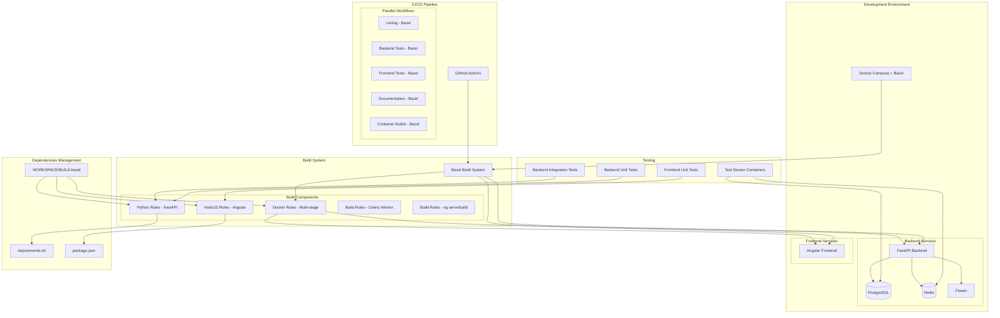

# Bazel Build System Implementation Plan for Fulcrum

## Overview

This plan outlines the implementation of the Bazel build system to improve project build performance, dependency management, and overall development workflow. The implementation will cover both backend (Python) and frontend (Angular) components, Docker builds, testing, documentation, and CI/CD integration.

## Goals

1. **Improve Build Performance**: Achieve faster, incremental builds with proper dependency tracking
2. **Enhance Scalability**: Better handle growing codebase complexity
3. **Ensure Reproducibility**: Consistent builds across development, testing, and production environments
4. **Optimize CI/CD**: Reduce build times and resource usage in GitHub Actions
5. **Streamline Dependency Management**: Centralize and manage all project dependencies

## Implementation Strategy

### Phase 1: Bazel Foundation Setup

1. **Install Bazel and Dependencies**
   - Install Bazel, Bazelisk (for version management)
   - Set up Bazel build extensions (rules_python, rules_nodejs, rules_docker)

2. **Create Initial Bazel Configuration Files**
   - `.bazelversion` - Pin Bazel version
   - `WORKSPACE` - Configure external dependencies
   - `.bazelrc` - Configure build options and default flags
   - Directory structure for BUILD files

### Phase 2: Backend (Python) Bazel Configuration

1. **Migrate Python Dependencies**
   - Convert `requirements.txt` to Bazel `pip_import` rules
   - Set up `requirements.bzl` for Python dependency management
   - Configure Python toolchain

2. **Create BUILD Files for Backend**
   - `backend/BUILD.bazel` - Build rules for main backend application
   - `backend/src/BUILD.bazel` - Python library rules for application code
   - `backend/tests/BUILD.bazel` - Test rules for backend tests

3. **Configure Python Application Build**
   - Create a `py_binary` rule for the backend FastAPI application
   - Configure dependencies and runtime requirements
   - Set up proper packaging for containerization

### Phase 3: Frontend (Angular) Bazel Configuration

1. **Migrate npm Dependencies**
   - Configure `yarn_install` or `npm_install` rules for frontend dependencies
   - Set up Node.js toolchain in Bazel

2. **Create BUILD Files for Frontend**
   - `frontend/BUILD.bazel` - Build rules for Angular application
   - Set up Angular compilation rules using `rules_nodejs`
   - Configure assets and static files

3. **Configure Angular Application Build**
   - Create build rules for different environments (development, production)
   - Set up proper bundling and optimization
   - Configure testing rules for frontend tests

### Phase 4: Docker Build Integration

1. **Configure Docker Build Rules**
   - Use `rules_docker` to build container images
   - Create separate rules for development and production images
   - Integrate with existing multi-stage Dockerfile approach

2. **Update Docker Compose**
   - Modify `docker-compose.yml` to optionally use Bazel-built images
   - Maintain backward compatibility with existing workflow

### Phase 5: Testing Integration

1. **Backend Tests**
   - Create `py_test` rules for all existing pytest tests
   - Configure test environments consistent with current setup
   - Set up database test fixtures in Bazel context

2. **Frontend Tests**
   - Integrate Web Test Runner with Bazel
   - Configure headless browser testing
   - Set up test fixtures and test dependencies

3. **Integration Tests**
   - Create test rules for end-to-end tests
   - Configure Docker-based integration test environments

### Phase 6: Documentation Updates

1. **Update README.md**
   - Add Bazel installation and usage instructions
   - Update Quick Start section to include Bazel commands
   - Document Bazel-specific workflows

2. **Update CONTRIBUTING.md**
   - Add Bazel development workflows
   - Update coding standards for BUILD files
   - Include guidelines for adding dependencies with Bazel

3. **Update Architecture Documentation**
   - Document the new Bazel build system architecture
   - Create a Mermaid diagram showing how Bazel fits with Docker, Angular, Redis, PostgreSQL

4. **Add Bazel-Specific Guides**
   - Create a new guide for Bazel usage in the project
   - Document common Bazel commands and workflows
   - Include troubleshooting section

### Phase 7: CI/CD Pipeline Updates

1. **GitHub Actions Workflows**
   - Update existing workflows to use Bazel builds
   - Optimize workflow caching using Bazel's build cache
   - Implement path-based triggers for Bazel builds

2. **Performance Optimizations**
   - Configure Bazel remote caching for CI
   - Set up build result caching to speed up CI runs
   - Optimize workflow parallelization based on Bazel targets

3. **Testing Workflow Updates**
   - Update test execution to use Bazel test rules
   - Configure test result reporting for GitHub
   - Implement test sharding for faster execution

## Implementation Timeline

### Week 1: Foundation Setup
- Set up Bazel environment and basic configuration
- Configure Python and Node.js toolchains
- Create initial WORKSPACE file

### Week 2: Backend Integration
- Migrate Python dependencies
- Create BUILD files for backend
- Configure backend application build

### Week 3: Frontend Integration
- Configure frontend dependencies
- Create BUILD files for frontend
- Set up Angular build rules

### Week 4: Docker and Testing
- Integrate Docker builds
- Configure testing infrastructure
- Run parallel with existing build system

### Week 5: CI/CD and Documentation
- Update GitHub Actions workflows
- Complete documentation updates
- Create Mermaid architecture diagram

### Week 6: Migration and Validation
- Run both build systems in parallel
- Validate all functionality
- Complete migration to Bazel

## Architecture Diagram (Mermaid)

## Risks and Mitigation

1. **Risk**: Learning curve for team members unfamiliar with Bazel
   - **Mitigation**: Provide comprehensive documentation and training materials

2. **Risk**: Potential breaking changes during migration
   - **Mitigation**: Run both build systems in parallel during transition

3. **Risk**: Complex Docker integration with Bazel
   - **Mitigation**: Start with simple container builds, then enhance gradually

4. **Risk**: CI/CD performance degradation during transition
   - **Mitigation**: Thorough testing in staging environment first

## Success Criteria

1. All existing functionality preserved after migration
2. Build times reduced by at least 30% for incremental changes
3. All tests passing with Bazel builds
4. GitHub Actions workflows successfully updated
5. Documentation updated and comprehensive
6. Team members trained on Bazel workflows